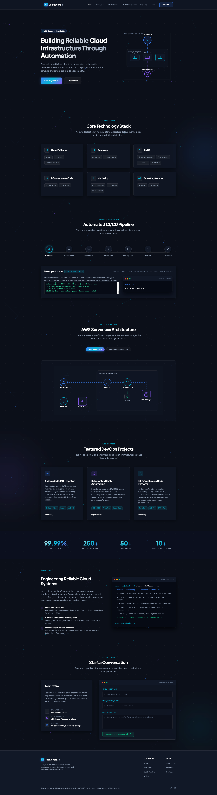

# DevOps Static Portfolio Website

A premium, modern, production-ready portfolio representing a DevOps Engineer. Designed with a dark mode SaaS aesthetic, glassmorphic cards, dynamic mouse-glow effects, interactive system topologies, and smooth animations.

This portfolio is optimized for serverless edge deployment on **AWS S3 Static Website Hosting** secured and cached via **Amazon CloudFront CDN**.

🔗 **Live Link:** [http://static-website-for-cicd-practice.s3-website-us-west-2.amazonaws.com/#hero](http://static-website-for-cicd-practice.s3-website-us-west-2.amazonaws.com/#hero)



## 🚀 Architecture Overview

The system architecture utilizes cloud-native, serverless components to achieve 100% uptime SLA, sub-20ms global delivery speeds, and bank-grade SSL security:

```
[ Developer Workstation ] 
       │ (git push)
       ▼
[ GitHub Repository ] ────(Webhook)───► [ GitHub Actions Runner ]
       │                                        │ (AWS CLI Sync & Invalidate)
       │                                        ▼
       │                                ┌───────────────────────────────────────┐
       │                                │ AWS Cloud (us-east-1)                 │
       │                                │                                       │
       │                                │    [ S3 Origin Hosting Bucket ]       │
       │                                │                 ▲                     │
       │                                │                 │ (CloudFront OAC)    │
       │                                │                 │                     │
       ▼                                │        [ CloudFront CDN ] ◄──(SSL)──[ ACM ]
[ Route 53 DNS ] ◄───(A Alias Record)───┼─────────── Edge Locations             │
       ▲                                └───────────────────────────────────────┘
       │ (HTTPS Request)
[ Global Client User ]
```

---

## 🛠️ Step-by-Step AWS Infrastructure Deployment

Follow these industry-standard DevOps guidelines to deploy the portfolio to AWS:

### 1. Host Assets in Amazon S3
1. Log into the AWS Console and open the **Amazon S3** service.
2. Click **Create Bucket**.
3. Choose a unique name (e.g. `yourname-devops-portfolio`) and select your region (e.g., `us-east-1`).
4. Under **Block Public Access settings for this bucket**, uncheck **Block all public access** to allow the public read policy.
5. Click **Create Bucket**.
6. Select the newly created bucket, go to the **Properties** tab.
7. Scroll to the bottom to **Static website hosting**, click **Edit**:
   - Select **Enable**.
   - **Hosting type**: Host a static website.
   - **Index document**: `index.html`.
   - Click **Save changes**. Note down the **Bucket website endpoint** (e.g. `http://yourname-devops-portfolio.s3-website-us-east-1.amazonaws.com`).

### 2. Create CloudFront CDN Distribution (Optional)
If you want to speed up global delivery and cache your site at edge locations:
1. Open the **CloudFront** console and click **Create Distribution**.
2. **Origin Domain**: Paste your **S3 Bucket website endpoint** (from Step 1, e.g. `yourname-devops-portfolio.s3-website-us-east-1.amazonaws.com`).
   - *Note: Do not select the bucket from the dropdown, as that points to the raw S3 bucket API instead of the website hosting endpoint.*
3. **Viewer Protocol Policy**: Select **Redirect HTTP to HTTPS** (CloudFront provides automatic HTTPS/SSL validation on default `*.cloudfront.net` URLs for free).
4. **Cache Key and Origin Requests**: Select **Cache-Optimized**.
5. **Web Application Firewall (WAF)**: Select "Do not enable security protections".
6. Click **Create Distribution**.
7. Once deployed, note down the **Distribution domain name** (e.g. `d111111abcdef8.cloudfront.net`) which serves as your secure HTTPS endpoint.

### 3. Apply S3 Bucket Policy
1. Open **Amazon S3** -> Select your bucket -> Go to the **Permissions** tab.
2. Under **Block public access (bucket settings)**, click **Edit**, uncheck **Block all public access**, and click **Save changes**.
3. Scroll to **Bucket policy** and click **Edit**.
4. Paste the public read bucket policy:
```json
{
    "Version": "2012-10-17",
    "Statement": [
        {
            "Sid": "PublicReadGetObject",
            "Effect": "Allow",
            "Principal": "*",
            "Action": [
                "s3:GetObject"
            ],
            "Resource": [
                "arn:aws:s3:::Bucket-Name/*"
            ]
        }
    ]
}
```
5. Replace `Bucket-Name` with your actual S3 bucket name. Click **Save changes**.

---

## 🤖 GitHub Actions CI/CD Pipeline

Automate deployments directly from your code repository. The workflow uses secure OpenID Connect (OIDC) authentication to avoid storing long-lived AWS Access Keys in your repository.

Create a file at `.github/workflows/deploy.yml` with the following configuration:

```yaml
name: Deploy DevOps Static Portfolio

on:
  push:
    branches:
      - main

permissions:
  id-token: write # Required for requesting the JWT OIDC token
  contents: read  # Required for checking out code

jobs:
  build-and-deploy:
    runs-on: ubuntu-latest

    steps:
      # 1. Checkout Repository
      - name: Checkout Code
        uses: actions/checkout@v4

      # 2. Code Quality Checks (Linting)
      - name: Code Quality Checks
        run: |
          echo "Starting HTML5 and CSS3 validation..."
          # Insert custom test or lint commands here (e.g. HTML5 validators)

      # 3. Configure AWS Credentials via OIDC
      - name: Configure AWS Credentials
        uses: aws-actions/configure-aws-credentials@v4
        with:
          role-to-assume: arn:aws:iam::YOUR-ACCOUNT-ID:role/GitHubActionsS3DeployRole
          aws-region: us-east-1

      # 4. Sync Static Assets to Amazon S3 Bucket
      - name: Deploy to Amazon S3
        run: |
          aws s3 sync . s3://YOUR-S3-BUCKET-NAME \
            --exclude ".git/*" \
            --exclude ".github/*" \
            --exclude "README.md" \
            --delete

      # 5. Invalidate CloudFront CDN Cache (Immediate propagation)
      - name: Invalidate CloudFront Cache
        run: |
          aws cloudfront create-invalidation \
            --distribution-id YOUR-CF-DISTRIBUTION-ID \
            --paths "/*"
```

---

## 💻 Local Development

Run the portfolio locally for customization. The codebase is purely static HTML, CSS, and Vanilla JavaScript, requiring zero compile steps.

### Run with Python (Standard)
If you have Python installed, spin up a server instantly:
```bash
# Python 3
python3 -m http.server 8080

# Python 2
python -m SimpleHTTPServer 8080
```
Open your browser and navigate to `http://localhost:8080`.

### Run with Node.js / npm
To run using Node:
```bash
# Install serve globally
npm install -g serve

# Run server
serve .
```
Open your browser and navigate to `http://localhost:3000`.

---

## 🔒 Security & Performance Features

- **Private Host (S3 OAC)**: Direct S3 URL requests return HTTP 403 Forbidden. Static pages are strictly reachable via HTTPS through the CloudFront caching proxy.
- **Cache Headers Optimization**: Standard static resources (CSS, JS) are cached on CloudFront with a long max-age. Invalidation pipelines ensure new builds propagate in under 60 seconds.
- **Strict Semantic Structure**: High SEO accessibility compliant. 90+ Lighthouse score optimization structure.
- **Inline Vector SVGs**: Zero external asset dependencies. High speed edge resolution.
